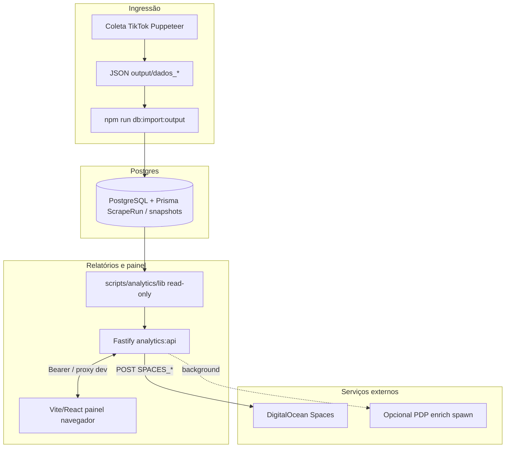

# Arquitetura — projeto TikTok Shop (categorias)

## Objetivo

Scraper de **categoria** (grelha) no **TikTok Shop** com **Puppeteer**: interceptar `application/json` e o JSON embebido `__MODERN_ROUTER_DATA__` no HTML, **sem abrir PDP** (reduz risco de puzzle/anti‑bot na página de produto).

## Estado actual do scraper (abril 2026)

- Pipeline **estável:** coleta por categoria, normalização, merge por `product_id`, testes de regressão (`npm test`) a verde.
- **Opcional:** `PDP_GALLERY=1` abre páginas de produto para `fotos_pdp` (mais lento); ver `FLUXO.md`.
- **Saídas:** `output/dados_produtos.json` + `output/dados_lojas.json` (+ ficheiros técnicos em `output/extra/`). O **contrato** destes JSONs está na secção **Contrato dos outputs** abaixo.

## Decisão arquitetural: modelo híbrido nos JSONs (mantido)

- **`dados_produtos.json`** continua a ser um export **flat / prático**: cada item tem `product_id`, nome, preço, vendas, imagens, **`seller_id`**, **`nome_loja`** e vários campos de loja (`loja_*`, logos). Essa **desnormalização é intencional** — leitura rápida, auditoria e análise sem `join` obrigatório.
- **`output/dados_lojas.json`** é o agregado **oficial por vendedor**: **uma** entrada por **`seller_id`** (dedupe e merge de campos entre produtos da mesma loja). Serve análise de sellers e **import** para Postgres (entre outros consumidores).
- **Ligação:** `seller_id` é a **chave** comum entre um item em `itens[]` e uma linha em `lojas[]`.
- **Não** remover, por agora, campos de loja de `dados_produtos.json` — evita quebrar consumidores e mantém o uso “abrir o ficheiro e ver tudo no item”.
- **Normalização na BD** (produto vs loja vs histórico no tempo) está em **`prisma/schema.prisma`** e é preenchida pelo importador (**não** obriga o JSON a espelhar coluna a coluna; o export do scraper continua a interface de coleta).

## Stack

- **Node.js** (ES modules), **Puppeteer** + `puppeteer-extra` + **Stealth**
- `setRequestInterception(true)` com `request.continue()` em todos os pedidos
- `page.on('response')` para ler corpos de respostas alvo
- **Persistência:** **PostgreSQL** + **Prisma** (modelo produto / loja / snapshots por `ScrapeRun`).
- **Analytics HTTP:** **Fastify** (`scripts/analytics/server.mjs`) — relatórios read-only sobre a BD (`scripts/analytics/lib/`), export para **DigitalOcean Spaces** com credenciais só no servidor.
- **Painel:** **Vite + React** (`frontend/`), proxy `/analytics/*` para a API em desenvolvimento; autenticação ao API com **`ANALYTICS_API_KEY`** (Bearer / `x-api-key`).

## Diagrama — dados ↔ API ↔ interface

Visão macro: a **coleta** alimenta a base; **API** e **UI** leem a mesma BD; export e jobs opcionais saem pela API.

**Notas:** Em **desenvolvimento**, API e frontend costumam ser dois processos (`npm run dev:all`). A coleta pode correr na **mesma máquina** ou noutra; desde que **`DATABASE_URL`** seja comum ou o **`input_hash`** alinhe imports, não é obrigatório o scraper estar no servidor do painel. Ver **`FLUXO.md`** para comandos e **`docs/ANALYTICS-API.md`** para endpoints exactos.

## Ponto de entrada

| Ficheiro | Papel |
|----------|--------|
| `src/scrapeCategory.mjs` | Único script principal: launch browser, `goto` categoria, scroll, coleta, escrita `output/` |

## Fluxo de dados (resumo)

1. Navegação para `CATEGORY_URL` (ou `DEFAULT_URL` no código).
2. Sessão persistente: diretório de perfil Chromium (por defeito **`.puppeteer-profile/tiktok-shop`** na raiz do repo; no Docker com `WORKDIR=/app` → `/app/.puppeteer-profile/tiktok-shop`). Overrides: **`CHROME_USER_DATA`**, **`PUPPETEER_TIKTOK_PROFILE`**; limpar com **`FRESH_SESSION=1`**. (Legado documental: `.chrome-tiktok-profile` — substituído pelo caminho acima no scraper actual.)
3. Relevante para login interativo: `HEADED=1`, `LOGIN_WAIT_MAX_MS` (aumenta se necessário) até `shop.tiktok.com`.
4. Heurísticas em respostas JSON (URLs com `oec`, `list`, `shop.tiktok`, etc.), filtrando **telemetria** (MCS, Slardar, monitor, batch 204, …).
4b. **View more (grelha):** após o scroll da categoria, o script pode clicar até **`VIEW_MORE_MAX_CLICKS`** vezes (máx. 10, default 8) em **View more** / **Ver mais** (e equivalentes), para a UI carregar mais blocos; os novos produtos entram pelo mesmo pipeline XHR + merge. Desligar: **`VIEW_MORE_MAX_CLICKS=0`** ou **`VIEW_MORE=0`**. Tempo de espera pós-clique (poll do contador): **`VIEW_MORE_DRAIN_MS`** (default 4500).
5. Dados iniciais no DOM: leitura de `#__MODERN_ROUTER_DATA__` → `loaderData` (rota `…/c/…/page`) fundido no mesmo mapa de produtos.
6. Normalização: `normalizeItem` (preço, desconto %, `seo_url` → `product_url`, imagens, etc.).
7. **Saídas “finais” na raiz de `output/`:** `dados_produtos.json` (PT‑BR, `itens[]`, `categoria_url`, `link_produto`, …) e `dados_lojas.json` (agregado por `seller_id`).
8. **Saída técnica e auxiliares:** `output/teste_categoria.json`, `modern_router_peek.json`, logs, `caca_*`, etc. em `output/extra/` (o agregado de lojas está na **raiz** de `output/` junto a `dados_produtos.json`).
9. **Debug / descoberta:** `modern_router_peek.json`, `caca_dados.jsonl`, `rede_ultima_execucao.log`, `debug_responses.log`, `debug_snapshots/`, `descoberta_redes.jsonl` (quando ativo).

## Modelo de dados (conceitual)

### Produto (product)

- **Chave de negócio:** `product_id` (e dedupe/merge do mapa em memória por este id).
- **Campos típicos (export):** `categoria_url`, `link_produto`, `nome`, preço, moeda, preço original, vendas, `fotos` / `fotos_pdp`, bloco de avaliações de produto.
- **No código:** `normalizeItem` (nó grelha), `mergeProductById` + `productRowRichness` (colisão de linhas), `toDadosProdutoClean` (shape JSON final por item).

### Loja (seller)

- **Chave lógica:** `seller_id` (ligação entre produto e entidade vendedor; `global_seller_id` quando existir no feed).
- **Campos típicos:** `nome_loja`, métricas de loja (`loja_vendas_total`, `loja_produtos_ativos`, …), logos (`loja_logo_uri`, `loja_logo_urls`), etc.
- **Duplicação intencional:** o mesmo vendedor aparece em **cada** item em `dados_produtos.json` (desnormalização para leitura rápida e análise sem `join` obrigatório).
- **Fonte agregada:** `output/dados_lojas.json` — uma entrada por `seller_id`, construída por `buildLojasMapBySeller` (merge de campos de loja entre produtos do mesmo vendedor). Tratar-se como **catálogo consolidado** de vendedor; o produto continua a carregar a cópia desnormalizada.
- **No código:** `normalizeSellerInfo`, `mergeLojaFromNormalized` / `extractLojaFromNormalized`, `lojaToRowFields`.

### Snapshot (estado no tempo) — Postgres

- Implementado como **`ProductSnapshot`** e **`SellerSnapshot`** em `prisma/schema.prisma`, ligados a **`ScrapeRun`** (uma coleta / import) e às dimensões **`Product`** / **`Seller`**.
- Cada run de importação grava **novas linhas** de snapshot (preço, vendas, imagens no produto; métricas agregadas na loja) sem sobrescrever histórico anterior.
- Preenchimento: **`scripts/import-output-to-db.mjs`** (`npm run db:import:output`) e o mesmo núcleo em **`scripts/lib/import-output-core.mjs`** (usado também por **`POST /scrape/import-remote`** na API analytics — worker local); sobre `output/dados_produtos.json` e `output/dados_lojas.json`; ver secção **Modelo Postgres** abaixo e `docs/LOCAL_SCRAPER_WORKER.md`.

## Contrato dos outputs

### `output/dados_produtos.json`

- **Papel:** ficheiro de **leitura rápida, auditoria e análise** por produto (export “flat”).
- **Conteúdo:** `itens[]` com dados do **produto** (`product_id`, nome, preço, moeda, vendas, `fotos` / `fotos_pdp`, avaliações, …) **e** chave e cópia de **loja** (`seller_id`, `global_seller_id`, `nome_loja`, `loja_*`, `loja_logo_*`).
- **Não** é a representação final do modelo relacional: é **conveniência** e desnormalização intencional; o modelo relacional canónico está no **Postgres / Prisma** (ver secção **Modelo Postgres**).

#### Contrato de preço (v1, validado)

Semântica dos campos numéricos de preço e desconto em `itens[]` (o pipeline real vive em `normalizeItem` → `toDadosProdutoClean`; **não** duplicar regra de negócio neste parágrafo — serve de referência e contrato para consumidores e revisões):

- **`preco`:** preço **principal** do pipeline (grelha / feed; pode ser reforçado no PDP com `PDP_GALLERY=1` conforme a lógica actual).
- **`preco_original`:** preenchido **só** quando existe **desconto confiável**; caso contrário `null` (incluindo “sem desconto” no sentido de negócio acordado no código).
- **`tem_desconto`:** `true` / `false` — espelha a decisão de desconto confiável do normalizador.
- **`preco_estimado_vitrine`:** estimativa alinhada à **UI de vitrine** em cenários com desconto (marcado como experimental / aditivo no código; ver testes de regressão).
- **`preco_gap_estimado` / `preco_gap_estimado_percent`:** derivados da estimativa em relação às bases do item (conforme `computePrecoEstimadoVitrineFields` e regras associadas).
- **Produtos sem desconto (contrato de saída):** `preco_original`, `preco_estimado_vitrine` e os dois gaps a **`null`**, e **`tem_desconto: false`**, coerente com a lógica validada.
- **Tolerância vs site:** pequenas diferenças de **centavos** face à UI são aceitáveis; **não** se exige correspondência “pixel-perfect”.
- **Estabilidade:** o módulo de preço v1 foi **validado manualmente** (abril 2026); alterações exigem testes e decisão (ver `docs/ROADMAP.md` e `.cursor/rules/scrape-mjs-patterns.mdc`).

**Futuro (não implementado):** score de confiança de preço, `price_source` interno, validação adicional com PDP em amostra — apenas roadmap, sem código obrigatório agora.

#### Contrato de vendas (v1, aprovado com ressalva)

- **`vendas`:** no mapa pós-`mergeProductById`, reflete o **maior** `sales_count` observado para o `product_id` quando existem colisões (várias respostas JSON). A extração em cada linha continua a vir de `normalizeItem` (ex. `sold_info` / cadeia de parse); o merge **não** soma duplicados, **toma o máximo** para não perder a melhor leitura entre XHR. **Semântica de consumo:** *melhor esforço* do feed consolidado, **não** contagem contábil nem correspondência certificada com a UI.
- **`vendas_texto`:** texto de venda do feed (`sales_display` interno) quando existir; regra: o merge **não** descarta texto útil **só** porque a linha vencedora traz `null` em `sales_display`.
- **UI e tolerância:** pequenas diferenças em relação ao número mostrado no site podem ocorrer (atualização, arredondamento de etiqueta). **Grandes** diferenças podem ser diferença de **métrica** (ex. variante, janela temporal, grelha parcial vs agregado na ficha) — **não** forçar interpretação de bug sem análise.
- **Não** tratar `vendas` como valor financeiro exato, total oficial ou substituto de relatório de vendas da plataforma.
- **Uso alinhado ao produto:** ranking, tendência, filtros, análise e priorização; combinar com preço, categoria, reviews conforme a análise.
- **Estabilidade:** o módulo de vendas v1 foi **validado** após a melhoria de merge; alterações a extração, `parseSalesText` ou `merge` de vendas exigem `npm test` e decisão (ver `docs/ROADMAP.md` e `.cursor/rules/scrape-mjs-patterns.mdc`).

**Futuro (não implementado):** `vendas_confianca`, `sales_source`, parse de `sales_display` rico, cruzamento com PDP/endpoint.

### `output/dados_lojas.json`

- **Papel:** ficheiro **agregado** de lojas / vendedores.
- **Conteúdo:** `lojas[]` com **uma** linha **por** `seller_id` (sem duplicar o mesmo vendedor em várias linhas).
- **Uso:** análise de vendedor, rankings de loja, e **import** onde se precisa de **um** registo por vendedor.
- Construção: merge no mapa de coleta (`buildLojasMapBySeller` no código; sem alterar este documento).

### Regra de ligação

- **`seller_id`** é a chave de ligação: cada produto com determinado `seller_id` corresponde à mesma chave no array `lojas` e ao registo **`sellers`** no Postgres após import.

| Ficheiro | O quê | Quando preferir |
|----------|--------|-----------------|
| `dados_produtos.json` | Produto + loja desnormalizada no item | Exploração, scripts simples, inspeção linha a linha |
| `dados_lojas.json` | Loja **deduplicada** por `seller_id` | Métricas por vendedor, import `sellers`, consistência de loja |

## Modelo Postgres (Prisma) — implementado

**Objetivo:** normalizar identidade (**produto**, **loja**) e **histórico por coleta** (**snapshots**) na base de dados; o JSON em `output/` continua a ser a **única saída do scraper** — o import não altera a coleta nem o formato dos JSONs.

### Onde está definido

- **Esquema:** `prisma/schema.prisma` (tabelas mapeadas `snake_case` no Postgres).
- **Import:** `scripts/import-output-to-db.mjs` (CLI) e **`POST /scrape/import-remote`** partilham **`scripts/lib/import-output-core.mjs`** — comando `npm run db:import:output` (requer `DATABASE_URL`). **Idempotência:** campo `input_hash` em `scrape_run`: reimportação do mesmo conteúdo (hash SHA-256 dos ficheiros consolidados) **não** duplica runs nem snapshots (`README.md`).

### Tabelas de dimensão (dados relativamente estáveis)

- **`products`** (`Product`): chave externa TikTok `product_id`, FK opcional para `sellers`, URLs, datas `first_seen` / `last_seen`; **upsert** no import (identidade atualizada, sem apagar histórico).
- **`sellers`** (`Seller`): `seller_id` único, `global_seller_id`, nome e logos conforme JSON.

### Histórico e auditoria por importação / run

- **`scrape_runs`** (`ScrapeRun`): uma linha **por importação** bem sucedida a partir do consolidado (metadados da coleta + `input_hash` quando aplicável). Campo opcional **`run_type`**: etiqueta da origem lógica do run (import padrão: `quick_scrape`; valores futuros definidos pelo processo que criar o run); **não** entra no cálculo de `input_hash`.
- **`product_snapshots`** / **`seller_snapshots`**: métricas e campos que mudam no tempo, **por run**; sempre **novas** linhas neste fluxo de import.

- **`raw_payloads`** (`RawPayload`): envelope **`consolidated_output`** com cópia do JSON importado para auditoria (dados frios).

### Diferença entre dado “quente” (dimensão) e snapshot

- **`products`** / **`sellers`**: identidade e último estado útil consolidado pelo import (upsert).
- **Snapshots**: série temporal entre coletas — evolução de preço, vendas e métricas de loja **sem** perder registos antigos ao importar outra vez.

### `seller_id` na BD

- Alinhamento ao TikTok nos JSONs: integridade entre `products.seller_ref_id` → `sellers.id` e métricas em `seller_snapshots`.

**Pipeline de scraping:** inalterado em `src/scrapeCategory.mjs` (e scripts de coleta). **Import JSON → Postgres** é **camada separada** — `scripts/lib/import-output-core.mjs` (e o CLI `scripts/import-output-to-db.mjs`) apenas mapeiam valores; não recalculam preço, vendas ou merge.

## Integridade (regressão)

- Alterações ao normalizador ou ao merge de produto/loja devem manter `npm test` a verde; ver `FLUXO.md` e `docs/ROADMAP.md`.

A pasta `output/*` **não** deve ser commitada (ver `.gitignore`); mantém-se `output/.gitkeep`.

## Variáveis de ambiente (principais)

| Variável | Efeito |
|----------|--------|
| `CATEGORY_URL` | URL da categoria a abrir |
| `HEADED=1` | Browser visível (login) |
| `CHROME_USER_DATA` | Perfil alternativo |
| `FRESH_SESSION=1` | Não reutilizar perfil local padrão |
| `NET_LOG=0` / `1` / `verbose` | Log de rede resumido ou completo |
| `HUNT_LOG=0` | Desligar ficheiros “caça” com `--debug` |
| `DISCOVER=1` | `descoberta_redes.jsonl` |
| `JSON_SNAPSHOT=1` | `debug_snapshots/` |
| `ROUTER_PEEK_LEN` | Tamanho da amostra em `modern_router_peek.json` (0 = só resumo) |

## Scripts `npm` (ver `package.json`)

- `scrape:category` — execução básica
- `scrape:category:debug` / `headed` / `peek` / `caca` / `discover` / `snap` — atalhos com `cross-env` no Windows

## Limitações conhecidas

- Grelha pode misturar nós de **review** com cartões; podem existir **duplicados** por `product_id` e linhas com poucos campos até haver filtro dedicado.
- Dados pessoais / tokens podem aparecer em **amostras** de debug do router — não versionar `output/`.

## Tarefas e decisões

- **Roadmap (fonte única):** [`docs/ROADMAP.md`](ROADMAP.md) (metodologia: estados de tarefa, sem ficheiros de checklist paralelos).
- **ADRs:** [`docs/adr/README.md`](adr/README.md).

## Repositório remoto

Organização: **abel398group-oss** — [projeto_tiktok-Categorias_v02](https://github.com/abel398group-oss/projeto_tiktok-Categorias_v02).

**Branches Git:** `main` (linha principal) e `backup` (cópia de segurança / referência). O desenvolvimento do utilizador pode estar em qualquer uma; confirmar com `git branch` antes de assumir a branch activa.
